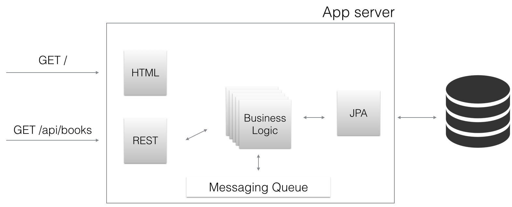
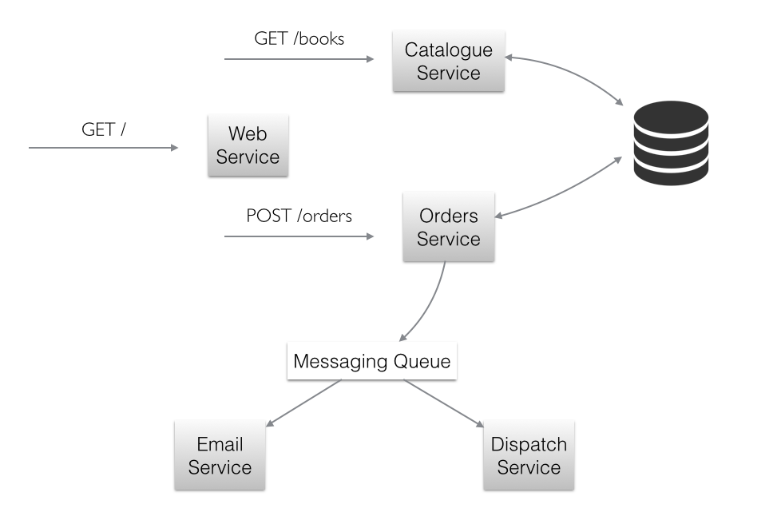

This article explores the way the microservice architecture can be used together with Java EE using the new KumuluzEE framework.
It expands on the benefits and drawbacks compared to the monolithic architecture that's popular in Java EE. It shows how to quickly and simply develop two microservices with standard Java EE using KumuluzEE. You can find the examples produced in this article on [GitHub](https://github.com/TFaga/kumuluzee-examples) under the name `microservice-simple`.

# Why microservices?

The industry standard approach for deploying Java EE applications is packing all components into single EAR/WAR archive and deploying the archive on an application server. Although this approach has several advantages, particularly from the ease-of-development perspective, it leads to monolithic architecture, makes applications difficult to maintain, and - particularly important - makes such applications more difficult and sometimes impossible to scale to meet today's real world demands, especially in PaaS (cloud) environments.

Microservice architecture addresses these shortcomings by decomposing an application into a set of microservices. Each microservice has well-defined functionalities and an interface to communicate with other microservices (such as REST, WSDL, or if needed even RMI). Most often, microservices are stateless. 

Instead of packing all microservices into a single archive (EAR/WAR), each microservice is developed and deployed independently of each other. This brings several advantages, such as:

- With microservices, applications are more flexible;
- Every microservice can be developed independently of other microservices, which simplifies lifecycle and change management, makes it easier to use different technologies or upgrade to newer versions;
- Makes it easier to adopt new technologies for parts of an application;
- Makes it much more efficient to scale applications in PaaS and Docker-like environments.

<!--more-->

Microservice approach also has its drawbacks, particularly in the added complexity, related to development and particularly to the deployment. To deploy microservices on stand-alone containers requires several steps, such as configuring the containers, defining the dependencies, deploying the microservices, etc.

# KumuluzEE

Enter KumuluzEE, a framework that automates the tasks, related to the deployment and configuration of Java EE applications following the microservice pattern and makes it seamless. We will showcase how you can use KumuluzEE to create microservices using standard Java EE APIs that run in every Java environment as any other Java application with little to no extra configuration thus eliminating the need for an application server.

# Getting started

Let's get started! First let's examine what KumuluzEE provides and how we can start using it to build our microservices. The main benefit is that we don't actually have to learn "yet another framework". KumuluzEE uses the *standard Java EE specification* and components that many developers and DevOps including us are very familiar with. In fact if you use the default configuration (which is perfectly fine for most cases) and manipulate your settings with environment variables that KumuluzEE defines, you don't have to write anything extra at all. You get the microservice benefits "for free". 

> You can write your microservices the same way you write your Java EE applications, using the same tools you always use. The framework will take care of bootstrapping all the required components to make your application run.

The result are small standalone (and preferably stateless) microservices that can run anywhere (remember "Write once, run anywhere") using technologies that used to require full blown heavyweight application servers. 

## Perfect for running in Dockerized environments

Using KumuluzEE we can easily break down existing monolithic applications into microservices and start deploying them to the cloud (or more exactly to PaaS). Since microservices with KumuluzEE are basically regular Java applications, they can run in virtually every cloud platform available thus offering an excellent middle ground between modern patterns/models and existing enterprise technologies.

## Components

KumuluzEE comes with support for several Java EE specifications that we can selectively use in our microservices. As of this writing KumuluzEE comes with the following technologies:

- Servlet 3.1
- JSP 2.3
- EL 3.0
- CDI 1.2
- JPA 2.1
- JAX-RS 2.0
- Bean Validation 1.1
- JSON-P 1.0

You can choose to include only those that you actually need. This means that you can use only the dependencies that you need, instead of always having the entire runtime present that's using your memory and slowing your microservice down. The next bigger release will include support for the following additional components:

- Websocket 1.1
- JSF 2.2
- JAX-WS 2.2

In the next weeks and months the framework will be further improved with additional supported Java EE APIs.

# Building Java EE microservices

> The premise is simple; use our existing knowledge of Java EE APIs to create multiple microservices that will be packaged and deployed independently to a scalable cloud platform.

Lets use KumuluzEE to see this in action. Supposed we would like to create an online book catalogue that people can browse and place orders for the books they like. While there would normally be many more functionalities, for brevity we are only going to look at the two of them; browsing available books and placing orders. Our goal will be to create an application with the following requirements:

- Users can browse books as a list or detailed view;
- For every book available users can place orders;
- User can view their order status.

With traditional application servers we would normally create a monolithic EAR package that would include our business logic and several WAR packages. Our architecture would look something like this:



We would have several beans deployed that would handle all the business logic, those would use a JPA module that would handle the connection to an underlying database as well as act as our ORM. We would have a web layer, which would consist of REST interfaces. These would call our business logic. And a static HTML5 JavaScript web application, which would call our REST interfaces. All the components would be packaged together into a single EAR and deployed to the application server.

At first this may seem as a perfectly good design. However we can quickly start to identify its shortcomings. When our application starts to grow and we get more and more traffic, we need to start scaling out. Initially we can scale up, however that can only get us so far. Sooner rather than later we need to start distributing our requests. The way we do that is to set up, configure and maintain a cluster of application servers which is usually - let's face it - a not so pleasant experience. And since virtually no cloud provider offers support for such configurations we are on our own. Even if we set it all up, we still have no simple way to provide true elasticity to our application.

Let's dig into some more problems:

- Soon we notice that the catalogue part of the application gets way more traffic than the orders part. So we would like to scale only the part that handles the book catalogue. Otherwise we would waste server resources.

- When applying updates, we would like to update each part (functionality) separately. This way, we can incrementally introduce changes and avoid potential disastrous bugs. With the monolithic architecture each change requires a full build and redeployment of the whole application.

- We would like to separate the front-end, because requests for purely static files are needlessly using or back-end resources.

- When a new version of Java or Java EE comes out, we would like to gradually update our app. Updating the entire thing at once can take a lot of time and can contain unexpected bugs.

- We identify that a part of our application is not well suited for Java and would like to use a different technology (Scala, NodeJS, ...) just for that part.

- If one part of the application fails, everything fails. Identifying the issue can also take a lot of time. For instance, if the orders start to fail, we would still like our books catalogue to keep working.

Many of these issues don't have a straightforward solution using the traditional monolithic approach.

### How can KumuluzEE solve these problems

So let's try the microservice approach and refactor our architecture to follow the microservice architectural pattern while continuing to use standard Java EE technologies. To achieve this, we are going to use the KumuluzEE framework:



We start by separating our concerns and split the catalogue and orders functionalities into two separately configured and deployed microservices. That way we have created microservices that are only concerned with their respected functionalities. We've also reduced the interference with one another and overall form a better modular and bug free application. Each one of them will communicate with each other through pre-defined REST interfaces. 

If we look at the problems we listed we can see that now with microservices we have a straightforward solution for each and every one of them:

- We can deploy to practically any cloud provider, including docker, and scale (horizontally and vertically) our microservices with a mouse click.

- We can provide dynamic scaling based on current load with services such as Heroku and AWS ELB.

- As every microservice is deployed separately, we can scale out (or up) each one of them as much as needed.

- Updating every microservice independently is a breeze. Every microservice is already a separate project with a separate repository and deployment configuration. We can slowly rollout new features and minimize bugs.

- We can create a separate microservice to contain our front-end static files. We then deploy it directly to a CDN or to a small instance in the cloud that sits behind a CDN.

- Each microservice can be written in a different technology or language. And since the microservices are communicating with each other using REST interfaces through plain HTTP, we can use any combination we want. Such a design also enables us to simply drop in a replacement for an existing microservice without reprogramming all the others.

- If one microservice fails, the others still function normally. When a different microservice is dependent on the one that failed, we can skip or temporary disable that particular functionality until it is back up.

We do however need to make sure that the microservices are stateless in nature as specific instances can be destroyed, started or moved at any time. Every resource that a microservice uses should be an external one that is provided via a connection string or parameters. For instance; PostgreSQL as a database, RabbitMQ as a messaging service, Redis as a cache provider and S3 or Swift as file storage.

However, this kind of approach does not come without its drawbacks. Setting up and configuring Java EE projects to accompany this kind of architecture may not be so trivial.

> We would also like to avoid using an application server instance for every microservice to reduce overhead and simplify configuration. This is where KumuluzEE comes in; it makes deployment and configuration seamless.

Now that we know what we want to do, let's write our microservices (finally)!

## Maven

We will create two projects, each one will contain its own microservice. For brevity's sake we will create both projects in the same repository. In real-world projects it is recommended to have a separate repository (git or otherwise) for each microservice so that they are treated as separate entities and have separate versioning and revision history as well as deployment.

We will be using Maven to create the application as that is our system of choice and currently the only build system supported. Gradle support will be coming in future versions.

Our project structure will look like this:

~~~
.
+-- catalogue
|   +-- src
|   |   +-- main
|   |   +-- test
|   +-- pom.xml
+-- models
|   +-- src
|   |   +-- main
|   |   +-- test
+-- orders
|   +-- src
|   |   +-- main
|   |   +-- test
|   +-- pom.xml
+-- pom.xml
~~~

Again this is only to simplify the example. In a real project the `catalogue` and `orders` folders/projects would each be in a separate repository. We have also added a module that will hold our JPA entities as they will be shared with our two microservices. First let's create the top-most `pom.xml` that will only serve in this example to include our main modules. We will be using `acme.com` as our package name and group id throughout the examples.

`FILE ./pom.xml`

```xml
<?xml version="1.0" encoding="UTF-8"?>
<project xmlns="http://maven.apache.org/POM/4.0.0"
         xmlns:xsi="http://www.w3.org/2001/XMLSchema-instance"
         xsi:schemaLocation="http://maven.apache.org/POM/4.0.0 http://maven.apache.org/xsd/maven-4.0.0.xsd">
    <modelVersion>4.0.0</modelVersion>

    <groupId>com.acme.books</groupId>
    <artifactId>books</artifactId>
    <version>1.0.0-SNAPSHOT</version>
    <packaging>pom</packaging>

</project>
```

Now let's create our first microservice project. We will be using maven archetype generation.

Run the following commands inside the project folder. This will generate the three projects we require.

```bash
$ mvn -B archetype:generate \
    -DarchetypeGroupId=org.apache.maven.archetypes \
    -DgroupId=com.acme.books \
    -DartifactId=catalogue
```

```bash
$ mvn -B archetype:generate \
    -DarchetypeGroupId=org.apache.maven.archetypes \
    -DgroupId=com.acme.books \
    -DartifactId=orders
```

```bash
$ mvn -B archetype:generate \
    -DarchetypeGroupId=org.apache.maven.archetypes \
    -DgroupId=com.acme.books \
    -DartifactId=models
```

## Add KumuluzEE

Now we need to add the appropriate dependencies. As mentioned the framework is completely modular which means that apart from the core functionality every Java EE component is packaged as a separate module and must be included explicitly as a dependency in order to use it. KumuluzEE will automatically detect which modules are included in the class path and properly configure them.

All modules are versioned and released together, which helps reducing cross version conflicts and bugs. So it is recommended to define a property with the current version of KumuluzEE and use it with every dependency.

NOTE: Use the same version for every module as not doing so might result in unexpected behavior.

`FILE ./catalogue/pom.xml`

```xml
<properties>
    <kumuluzee.version>1.0.0</kumuluzee.version>
</properties>
```

First include the `core` module, which includes the bootstrapping logic and configurations.

`FILE ./catalogue/pom.xml`

```xml
<dependency>
    <groupId>com.kumuluz.ee</groupId>
    <artifactId>kumuluzee-core</artifactId>
    <version>${kumuluzee.version}</version>
</dependency>
```

Now the core itself won't do much without something to run. At the very least we have to include an HTTP server that will process our applications requests and forward them to our desired Java EE components. Jetty is the preferred choice for the servlet implementation for its high performance and small footprint. Support for different servers like Tomcat, Grizzly and Undertow is coming soon.

`FILE ./catalogue/pom.xml`

```xml
<dependency>
    <groupId>com.kumuluz.ee</groupId>
    <artifactId>kumuluzee-servlet-jetty</artifactId>
    <version>${kumuluzee.version}</version>
</dependency>
```

This is the bare minimum required to run a microservice with plain servlets and static files. Let's try it out! KumuluzEE will use a `webapp` folder at the root of your `resource` folder to look for files and configuration regarding it. This is the only difference to the standard Java EE file structure as the `webapp` folder has to be inside the `resource` folder, not alongside it. 

We don't need to include a web.xml file, because KumuluzEE supports annotation scanning. However, when and if you need it, you can simply add it and it will be automatically detected and used.

Let's add a simple HTML file.

`FILE ./catalogue/src/main/resources/webapp/index.html`

```html
<!DOCTYPE html>
<html>
<head>
    <meta charset="utf-8" />
    <title>Book catalogue</title>
</head>
<body>
    <p>Here we could display the book catalogue</p>
</body>
</html>
```

And this is all you need to do. The `kumuluzee-core` package provides the class `com.kumuluz.ee.EeApplication` with a main method that will bootstrap your app. If you have your project opened in an IDE (IntelliJ, Eclipse, ...), you can now start the microservice creating a new run configuration, selecting `Java application` and enter the above class as the `Main class` attribute. If however you are looking to run it from the terminal (as will be the case on a server and various PaaS environments), then you run it directly from the class files in the target directory.

NOTE: If you forget to add the `webapp` folder or accidentally misplace it, KumuluzEE will warn you with very descriptive messages.

To do so, you must include the `maven-dependency-plugin` to your `pom.xml` file, which will copy all your dependencies together with your classes.

`FILE ./catalogue/pom.xml`

```xml
<plugin>
    <groupId>org.apache.maven.plugins</groupId>
    <artifactId>maven-dependency-plugin</artifactId>
    <version>2.10</version>
    <executions>
        <execution>
            <id>copy-dependencies</id>
            <phase>package</phase>
            <goals>
                <goal>copy-dependencies</goal>
            </goals>
        </execution>
    </executions>
</plugin>
```

Run `maven package` and then you can start your microservice using the following command:

```bash
$ java -cp catalogue/target/classes:catalogue/target/dependency/* com.kumuluz.ee.EeApplication
```

Go to http://localhost:8080/ in your browser and you should see the HTML file that we added.

And that is it. We went through our project structure and a basic overview of what KumuluzEE does for you. You add the required dependencies and start developing standard Java EE applications.

## Using standard Java EE to implement our microservices

Let's add the remaining required dependencies. We will need JAX-RS for the REST interfaces (JPA will be included in the `models` module). For simplicity, we will add CDI as well, as it comes with `EntityManager` injection using `@PersistenceContext`. However, we could just as well do without to keep our microservice even lighter.

`FILE ./catalogue/pom.xml`

```xml
<dependency>
    <groupId>com.kumuluz.ee</groupId>
    <artifactId>kumuluzee-jax-rs</artifactId>
    <version>${kumuluzee.version}</version>
</dependency>
<dependency>
    <groupId>com.kumuluz.ee</groupId>
    <artifactId>kumuluzee-cdi</artifactId>
    <version>${kumuluzee.version}</version>
</dependency>
```

Again if we wanted additional components, as of this writing, we can use these additional ones.

```xml
<dependency>
    <groupId>com.kumuluz.ee</groupId>
    <artifactId>kumuluzee-jpa</artifactId>
    <version>${kumuluzee.version}</version>
</dependency>
```

```xml
<dependency>
    <groupId>com.kumuluz.ee</groupId>
    <artifactId>kumuluzee-jsp</artifactId>
    <version>${kumuluzee.version}</version>
</dependency>
```

```xml
<dependency>
    <groupId>com.kumuluz.ee</groupId>
    <artifactId>kumuluzee-bean-validation</artifactId>
    <version>${kumuluzee.version}</version>
</dependency>
```

```xml
<dependency>
    <groupId>com.kumuluz.ee</groupId>
    <artifactId>kumuluzee-json-p</artifactId>
    <version>${kumuluzee.version}</version>
</dependency>
```

### JPA module

In the JPA module we will add our `persistence.xml` and entity classes that will be shared with both our microservices even though they will be ran separately. In the example we will use the PostgreSQL database. However, you are free to use any database JPA supports. Just add the driver as a dependency.

`FILE ./models/pom.xml`

```xml
<properties>
    <kumuluzee.version>1.0.0</kumuluzee.version>
</properties>

...

<dependency>
    <groupId>com.kumuluz.ee</groupId>
    <artifactId>kumuluzee-jpa</artifactId>
    <version>${kumuluzee.version}</version>
</dependency>
<dependency>
    <groupId>org.postgresql</groupId>
    <artifactId>postgresql</artifactId>
    <version>9.4-1201-jdbc41</version>
</dependency>
```

`FILE ./models/src/main/resources/META-INF/persistence.xml`

```xml
<?xml version="1.0" encoding="UTF-8" ?>

<persistence xmlns="http://xmlns.jcp.org/xml/ns/persistence"
             xmlns:xsi="http://www.w3.org/2001/XMLSchema-instance"
             xsi:schemaLocation="http://xmlns.jcp.org/xml/ns/persistence
             http://xmlns.jcp.org/xml/ns/persistence/persistence_2_1.xsd"
             version="2.1">
    <persistence-unit name="books" transaction-type="RESOURCE_LOCAL">

        <class>com.acme.books.models.Book</class>
        <class>com.acme.books.models.BookOrder</class>

        <properties>
            <property name="javax.persistence.jdbc.driver" value="org.postgresql.Driver" />
            <property name="javax.persistence.jdbc.url"
                      value="jdbc:postgresql://localhost/books" />
            <property name="javax.persistence.jdbc.user" value="postgres" />
            <property name="javax.persistence.jdbc.password" value="postgres" />

            <property name="javax.persistence.schema-generation.database.action" value="create"/>
            <property name="javax.persistence.schema-generation.create-source" value="metadata"/>
            <property name="javax.persistence.schema-generation.drop-source" value="metadata"/>
        </properties>

    </persistence-unit>
</persistence>
```

The values defined in the xml for the url, username and password can be overwritten by setting the `DATABASE_URL`, `DATABASE_USER` and `DATABASE_PASS` environment variables respectively.

`FILE ./models/src/main/java/com/acme/books/models/Book.java`

```java
@Entity
@NamedQuery(name="Book.findAll", query="SELECT b FROM Book b")
public class Book {

    @Id
    @GeneratedValue(strategy = GenerationType.IDENTITY)
    private Integer id;
	
    private String title;
	
    private String description;
	
    private String author;
	
    @OneToMany(mappedBy="book")
    private List<BookOrder> bookOrders;

    public Integer getId() {
        return id;
    }

    public void setId(Integer id) {
        this.id = id;
    }

    public String getTitle() {
        return title;
    }

    public void setTitle(String title) {
        this.title = title;
    }

    public String getDescription() {
        return description;
    }

    public void setDescription(String description) {
        this.description = description;
    }

    public String getAuthor() {
        return author;
    }

    public void setAuthor(String author) {
        this.author = author;
    }
    public List<BookOrder> getBookOrders() {
        return bookOrders;
    }

    public void setBookOrders(List<BookOrder> bookOrders) {
        this.bookOrders = bookOrders;
    }
}
```

`FILE ./models/src/main/java/com/acme/books/models/BookOrder.java`

```java
@Entity
@NamedQuery(name="BookOrder.findAll", query="SELECT o FROM BookOrder o")
public class BookOrder {

    @Id
    @GeneratedValue(strategy = GenerationType.IDENTITY)
    private Integer id;
	
    @Temporal(TemporalType.TIMESTAMP)
    private Date orderDate;
	
    @ManyToOne
    @JoinColumn(name="book_id")
    private Book book;

    public Integer getId() {
        return id;
    }

    public void setId(Integer id) {
        this.id = id;
    }

    public Date getOrderDate() {
        return orderDate;
    }

    public void setOrderDate(Date orderDate) {
        this.orderDate = orderDate;
    }

    public Book getBook() {
        return book;
    }

    public void setBook(Book book) {
        this.book = book;
    }
}
```

### Orders module

Now let's implement the orders module. We'll create an order resource that will contain two methods; `placeOrder(Book)` and `getOrder()`. We need to add the correct dependencies, a JAX-RS application and a JAX-RS resource.

NOTE: Don't forget to add the `webapp` folder to the root of your orders resource directory. You may also need to add a file inside the directory for certain tools to include the folder. In any case you should get very descriptive error messages.

`FILE ./orders/pom.xml`

```xml
<properties>
    <kumuluzee.version>1.0.0</kumuluzee.version>
</properties>

...

<dependency>
    <groupId>com.acme.books</groupId>
    <artifactId>models</artifactId>
    <version>1.0.0-SNAPSHOT</version>
</dependency>
<dependency>
    <groupId>com.kumuluz.ee</groupId>
    <artifactId>kumuluzee-core</artifactId>
    <version>${kumuluzee.version}</version>
</dependency>
<dependency>
    <groupId>com.kumuluz.ee</groupId>
    <artifactId>kumuluzee-servlet-jetty</artifactId>
    <version>${kumuluzee.version}</version>
</dependency>
<dependency>
    <groupId>com.kumuluz.ee</groupId>
    <artifactId>kumuluzee-jax-rs</artifactId>
    <version>${kumuluzee.version}</version>
</dependency>
<dependency>
    <groupId>com.kumuluz.ee</groupId>
    <artifactId>kumuluzee-cdi</artifactId>
    <version>${kumuluzee.version}</version>
</dependency>

...

<plugin>
    <groupId>org.apache.maven.plugins</groupId>
    <artifactId>maven-dependency-plugin</artifactId>
    <version>2.10</version>
    <executions>
        <execution>
            <id>copy-dependencies</id>
            <phase>package</phase>
            <goals>
                <goal>copy-dependencies</goal>
            </goals>
        </execution>
    </executions>
</plugin>
```

The application:

`FILE ./orders/src/main/java/com/acme/books/OrdersApplication.java`

```java
@ApplicationPath("/")
public class OrdersApplication extends javax.ws.rs.core.Application {

}
```

And the resource:

`FILE ./orders/src/main/java/com/acme/books/OrdersResource.java`

```java
@Path("/orders")
@Produces(MediaType.APPLICATION_JSON)
@Consumes(MediaType.APPLICATION_JSON)
@RequestScoped
public class OrdersResource {

    @PersistenceContext(unitName = "books")
    private EntityManager em;

    @GET
    @Path("/{id}")
    public Response getOrder(@PathParam("id") Integer id) {

        BookOrder o = em.find(BookOrder.class, id);

        if (o == null)
            return Response.status(Response.Status.NOT_FOUND).build();

        return Response.ok(o).build();
    }

    @POST
    public Response placeOrder(Book b) {
       
        BookOrder o = new BookOrder();
        o.setBook(b);
        o.setOrderDate(new Date());

        em.getTransaction().begin();

        em.persist(o);

        em.getTransaction().commit();

        return Response.status(Response.Status.CREATED).entity(o).build();
    }
}
```

As you can see the microservice is exactly the same as any other Java EE app. As of right now we have to manually manage transactions as the JTA module is not yet available. We can do so by either creating a simple CDI interceptor that will start and commit them or manually do it in every method. Either way, sometimes a bit more transparency may be a good thing.

> A microservice can and should contain multiple REST resources. To put it differently; it should contain as many REST resources as it needs to perform the functions it is designed to do.

We can also notice that we are injecting our `EntityManager` with the `@PersistenceContext` annotation. Since we have included CDI to our microservice this will work as expected. We do however need to make sure that we have included the `beans.xml` file in our `META-INF` directory. That way we tell CDI to enable injection in this module.

`FILE ./orders/src/main/resources/META-INF/beans.xml`

```xml
<?xml version="1.0" encoding="UTF-8"?>
<beans xmlns="http://xmlns.jcp.org/xml/ns/javaee" xmlns:xsi="http://www.w3.org/2001/XMLSchema-instance"
       xsi:schemaLocation="
		http://xmlns.jcp.org/xml/ns/javaee
		http://xmlns.jcp.org/xml/ns/javaee/beans_1_2.xsd"
       bean-discovery-mode="annotated">

</beans>
```

Alright, let's now return to our catalogue model and finish our example.

### Catalogue module

We have already added the required dependencies when we were getting familiar with KumuluzEE, except for the JPA module that we created before.

`FILE ./catalogue/pom.xml`

```xml
<dependency>
    <groupId>com.acme.books</groupId>
    <artifactId>models</artifactId>
    <version>1.0.0-SNAPSHOT</version>
</dependency>
```

All that remains now is the REST resource implementation, that will actually be very similar to our orders resources.

`FILE ./catalogue/src/main/java/com/acme/books/BooksApplication.java`

```java
@ApplicationPath("/")
public class BooksApplication extends javax.ws.rs.core.Application {

}
```

And the resource:

`FILE ./catalogue/src/main/java/com/acme/books/BooksResource.java`

```java
@Path("/books")
@Produces(MediaType.APPLICATION_JSON)
@Consumes(MediaType.APPLICATION_JSON)
@RequestScoped
public class BooksResource {

    @PersistenceContext(unitName = "books")
    private EntityManager em;

    @GET
    public Response getBooks() {

        TypedQuery<Book> query = em.createNamedQuery("Book.findAll", Book.class);

        List<Book> books = query.getResultList();

        return Response.ok(books).build();
    }

    @GET
    @Path("/{id}")
    public Response getBook(@PathParam("id") Integer id) {
       
        Book b = em.find(Book.class, id);

        return Response.ok(b).build();
    }

    @POST
    public Response createBook(Book b) {

        b.setId(null);

        em.getTransaction().begin();

        em.persist(b);

        em.getTransaction().commit();

        return Response.status(Response.Status.CREATED).entity(b).build();
    }
}
```

Again make sure you have added the same `beans.xml` file as before to your `META-INF` directory in order to enable injection.

## Putting it all together

And we're done. We have just created two microservices that will run independently of each other. However they can still work together with the help of REST interfaces and of course share common resources like a database. We can now build and run them independently. Because we will be starting two HTTP servers, we must use a different port for the other server. We can easily control this using the `PORT` environment variable.

```bash
$ PORT=3000 java -cp catalogue/target/classes:catalogue/target/dependency/* com.kumuluz.ee.EeApplication
```

```bash
$ PORT=3001 java -cp orders/target/classes:orders/target/dependency/* com.kumuluz.ee.EeApplication
```

We can now browse our microservices and see them in action on `http://localhost:3000` and `http://localhost:3001` respectively.

# In conclusion

We have shpwn how KumuluzEE can help you creating microservices using standard Java EE specification and APIs. With KumuluzEE we are able to bridge the gap between Java EE and the microservice architecture and focus solely on developing with what we already know but in a completely new way. KumuluzEE seamlessly sets everything up automatically so we don't have too, while still allowing a great deal of customisation to accommodate our needs. On top of that it makes it easy to run our microservices. This opens a world of possible cloud configurations with almost any cloud provider out there that are simply not possible now. It also provides all the other benefits of microservices, including more flexible architecture, easier maintenance, better scalability, etc. without the added configuration overhead.

# Read on

- Get familiar with [KumuluzEE](https://ee.kumuluz.com)
- View the code on [GitHub](https://github.com/TFaga/kumuluzee-examples)
- Discover [microservices](http://microservices.io)
