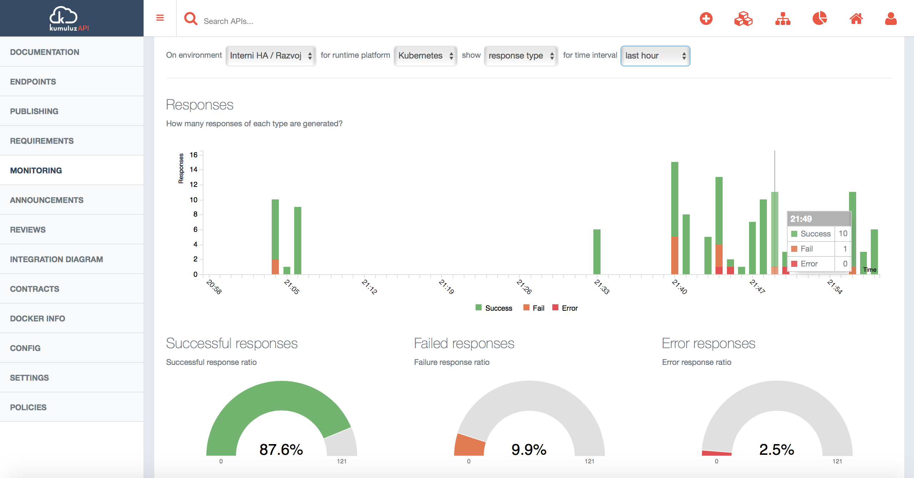
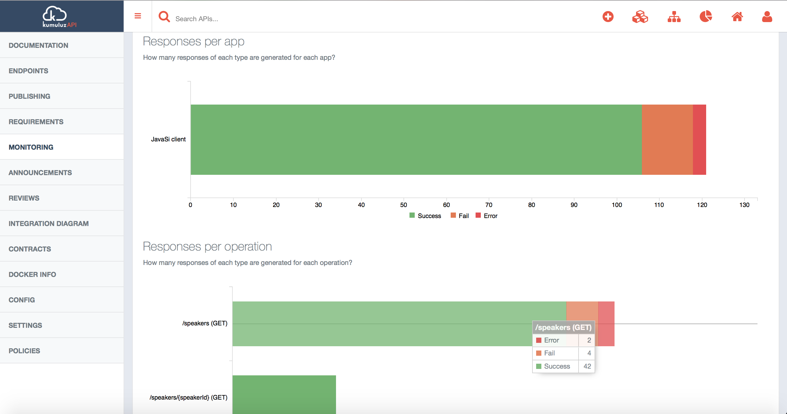
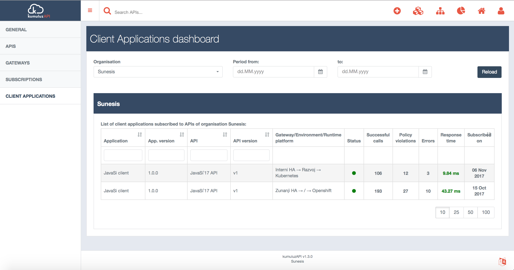

Monitoring of APIs is one of the essential functionalities of API Management tools. API Gateways collect and record different metrics of API invocations.

# API Monitoring in KumuluzAPI

KumuluzAPI provides multiple API monitoring views with different granularity. One of the most important monitoring views provided on the level of the API. KumuluzAPI allows you to view metrics for each environment and runtime platform on which API is running.
The following metrics are recorded for each API:
- **Usage** - shows number of API calls on the level of API, API endpoint and client application.
- **Response type** - shows the statistic of API calls based on the response type (success, fail and error). Statistics are shown for the level of API, API endpoint and client application.
- **Duration** - shows the average response type on the level of API, API endpoints and client applications.
- **Availability** - shows the API availability monitoring status which is performed periodically by KumuluzAPI to detect API unavailability (it also includes automatic alerts to inform API owner).

All metrics can be viewed for the following time periods: 1 hour, 24 hours, 7 days, 30 days and 90 days.

The following picture shows *response type* view metrics on the level of API:

<!--more-->

Response type statistics are recorded also for each Client application and API Endpoint:

## KumuluzAPI Monitoring dashboards

API level monitoring view is only one monitoring perspective. KumuluzAPI also provides dashboards to monitor APIs, Client applications, API subscriptions and API Gateways within some organisation.

Client application dashboard shows the subscription status, number of successful calls, number of failed calls (access policy violations), number of errors and average response time.

More to follow.

