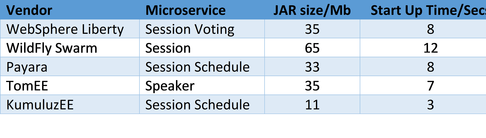
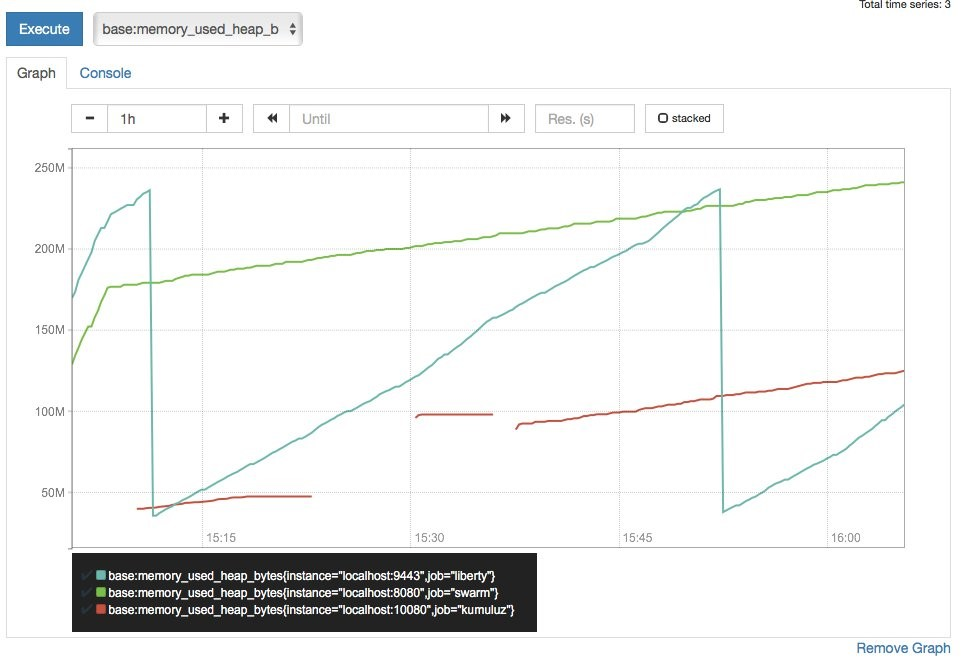

When selecting a framework for Java EE microservices, you should consider the start-up time, size and memory footprint of a microservice. 

The article [Java EE microservices: why start-up time and size matter]( https://www.linkedin.com/pulse/java-ee-microservices-why-start-up-time-size-matters-matjaz-b-juric/) shows an interesting comparison of MicroProfile Java EE frameworks, including WebSphere Liberty, WildFly Swarm, Payara, TomEE and KumuluzEE.

KumuluzEE has achieved the fastest start-up time of 3 seconds and the smallest JAR size (11 MB):

Also, it has the smallest memory footprint:

More: [Java EE microservices: why start-up time and size matter]( https://www.linkedin.com/pulse/java-ee-microservices-why-start-up-time-size-matters-matjaz-b-juric/) 
