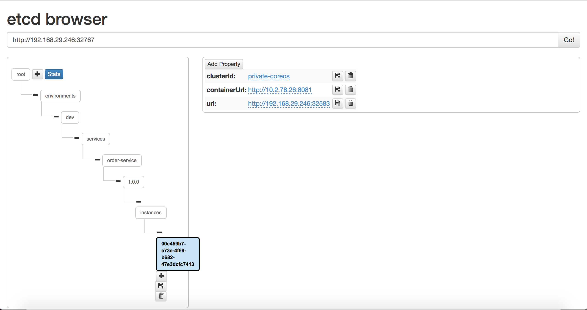

Today Kubernetes is one of the most commonly used runtime platforms for the containerized applications. Providing automatic binpacking, horizontal scaling, automated rollouts and rollbacks, self-healing, service discovery, load balancing and other services out of the box, Kubernetes is a platform that suits microservices down to the ground.

However, equally as important as the utilities provided by the runtime environment is the ability of microservice framework to exploit provided utilities. In this three-part blog, we will demonstrate how KumuluzEE microservice framework is able to make use of Kubernetes for optimal execution of the microservices.

<!--more-->

## Prerequisites and sample microservices
Our sample is comprised of two KumuluzEE microservices that are connected. Microservices are using service discovery and service configuration, which means we need a working etcd cluster before we can start deploying our microservices. Be aware this etcd cluster is not the same as the one Kubernetes is using for cluster state.

Both microservices will read configuration from service configuration cluster. We will also demonstrate how to use Kubernetes ConfigMap to store configuration that usually does not change during the lifetime of a microservice, e.g. URL of service discovery and configuration cluster. Service configuration cluster allows us to live-update the configuration of microservice, we cannot achieve the same using the Kubernetes ConfigMaps (yet [ConfigMap rollouts](https://github.com/kubernetes/kubernetes/issues/22368)) as any change would require a restart.

We will use two KumuluzEE microservices: **kubernetes-customers** and **kubernetes-orders**. Both microservices are comprised of three maven modules:
* ***api***: REST API serving data,
* ***business-logic***: CDI beans implementing business logic,and
* ***persistence***: JPA module handling database access.

As we are focused on packaging and deployment of KumuluzEE microservices to Kubernetes we will skip further implementation details. Each microservice has its own Postgresql database which we deployed beforehand.

### Deploying etcd service discovery and configuration cluster

The following code snippet shows configuration for etcd Deployment and Service:

```yaml
apiVersion: apps/v1beta1
kind: Deployment
metadata:
  name: etcd-deployment
  namespace: kumuluzee-blog
spec:
  replicas: 1
  template:
    metadata:
      labels:
        app: etcd
    spec:
      containers:
      - command:
        - /usr/local/bin/etcd
        - --name
        - etcd0
        - --initial-advertise-peer-urls
        - http://etcd:2380
        - --listen-peer-urls
        - http://0.0.0.0:2380
        - --listen-client-urls
        - http://0.0.0.0:2379
        - --advertise-client-urls
        - http://etcd:2379
        - --initial-cluster-state
        - new
        - -cors
        - "*"
        - --data-dir
        - /etcd-data
        image: quay.io/coreos/etcd:latest
        name: etcd
        ports:
        - containerPort: 2379
          name: client
          protocol: TCP
        - containerPort: 2380
          name: server
          protocol: TCP
        volumeMounts:
          - mountPath: /etcd-data
            name: etcddata
      volumes:
        - name: etcddata
          emptyDir: {}

---

apiVersion: v1
kind: Service
metadata:
  name: etcd
  namespace: kumuluzee-blog
spec:
  type: NodePort
  ports:
  - name: client
    port: 2379
    protocol: TCP
    targetPort: 2379
  selector:
    app: etcd
```

## Step 1: Building Docker images
Each microservice is packaged into Docker image. Bellow you can see the content of Dockerfile for **kubernetes-customers** microservice:

```Dockerfile
FROM openjdk:8-jre-alpine

RUN mkdir /app

WORKDIR /app

ADD ./api/target/customers-api-1.0.0-SNAPSHOT.jar /app

EXPOSE 8080

CMD ["java", "-jar", "customers-api-1.0.0-SNAPSHOT.jar"]
```

Microservice **kuberntes-orders** has the same Docker file, the only difference is the name of jar.

Built images are publicly available on Dockerhub:
* **kubernetes-customers**: zvoneg/kubernetes-customers:v1.0.5
* **kubernetes-orders**: zvoneg/kubernetes-orders:v1.0.5

## Step 2: Preparing Kubernetes configuration files
So far we deployed etcd cluster fo service discovery and configuration, deployed databases for each microservice and prepared docker images for our microservices. Next we need to define static configuration for both microservice. We will do so using ConfigMap.

### Static configuration using ConfigMap
ConfigMap is Kubernetes object used to decuple the configuration artifacts from image content. In the case of our microservice we use ConfigMap for the configuration of discovery cluster name, discovey etcd cluster hosts, connectionurl of the datasource, server url (service address for service registration) and conection url of the datasource for healthcheck.

ConfigMap of the kubernetes-customers microservice (customers-cm.yaml):

```yaml
apiVersion: v1
kind: ConfigMap
metadata:
  name: kubernetes-customer-config
  namespace: kumuluzee-blog
data:
  KUMULUZEE_DISCOVERY_CLUSTER: private-coreos
  KUMULUZEE_DISCOVERY_ETCD_HOSTS: http://etcd:2379
  KUMULUZEE_CONFIG_ETCD_HOSTS: http://etcd:2379
  KUMULUZEE_DATASOURCES0_CONNECTIONURL: jdbc:postgresql://postgres-customers:5432/customer
  KUMULUZEE_SERVER_BASEURL: http://192.168.29.246:32600
  KUMULUZEE_HEALTH_CHECKS_DATASOURCEHEALTHCHECK_CONNECTIONURL: jdbc:postgresql://postgres-customers:5432/customer
```

 and ConfigMap of the kubernetes-orders microservice (orders-cm.yaml):

 ```yaml
 apiVersion: v1
kind: ConfigMap
metadata:
  name: kubernetes-order-config
  namespace: kumuluzee-blog
data:
  KUMULUZEE_DISCOVERY_CLUSTER: private-coreos
  KUMULUZEE_DISCOVERY_ETCD_HOSTS: http://etcd:2379
  KUMULUZEE_CONFIG_ETCD_HOSTS: http://etcd:2379
  KUMULUZEE_DATASOURCES0_CONNECTIONURL: jdbc:postgresql://postgres-orders:5432/order
  KUMULUZEE_SERVER_BASEURL: http://192.168.29.246:32583
  KUMULUZEE_HEALTH_CHECKS_DATASOURCEHEALTHCHECK_CONNECTIONURL: jdbc:postgresql://postgres-orders:5432/order
 ```

### Deployment configuration
First we define deployment configuration for  **kubernetes-orders** microservice. This microservice is configured to register itself to the service registry when the pod (replica) is started. KumuluzEE framework will obtain the pod IP address and insert the record into the service registry. Remember, data to access service registry is provided through the propertise defined in the ConfigMap which we need to reference in deployment configuration. KumuluzEE configuration extension will automatically read the configuration from container environment variables.

The content of deployment file for the **kubernetes-orders** microservice (order-deployment.yaml):

```yaml
apiVersion: apps/v1beta1
kind: Deployment
metadata:
  name: order-deployment
  namespace: kumuluzee-blog
spec:
  replicas: 1
  template:
    metadata:
      labels:
        app: order
    spec:
      containers:
      - image: zvoneg/kubernetes-orders:v1.0.5
        name: kubernetes-orders
        envFrom:
          - configMapRef:
              name: kubernetes-order-config
        ports:
        - containerPort: 8081
          name: server
          protocol: TCP
```

We proceed with defining **kubernetes-customers** microservice deployment configuration. This microservice is consuming the **kubernetes-orders** microservice, i.e. is performing service discovery. To provide information for service registry we again use properties defined in ConfigMap.

Deployment configuration for **kubernetes-customers** microservice (customer-deployment.yaml):

```yaml
apiVersion: apps/v1beta1
kind: Deployment
metadata:
  name: customer-deployment
  namespace: kumuluzee-blog
spec:
  replicas: 1
  template:
    metadata:
      labels:
        app: customer
    spec:
      containers:
      - image: zvoneg/kubernetes-customers:v1.0.5
        name: kubernetes-customer
        envFrom:
          - configMapRef:
              name: kubernetes-customer-config
        ports:
        - containerPort: 8080
          name: server
          protocol: TCP
```

During startup kubernetes-customers microservice will perform service discovery to obtain IP of the kubernetes-orders pod (or Kubernetes service). This is performed by kumuluzee-discovery extension.

### Kubernetes service configuration

With kumuluzee-discovery, we can overcome the problem of pod mortality as each microservice is able to register its pod IP into the service registry which is taken care of by kumuluzee-discovery extension. If multiple replicas are running for some microservice there will be multiple entries in the service registry. KumuluzEE discovery will also take care of the scenarios when a replica is killed by removing an entry from the registry. This, in theory, means we do not need to create Kubernetes services if our microservices only need to be accessible inside the Kubernetes cluster. The advantage of this approach is that the step where service IP needs to be translated into pod IP is skipped as we know the IP od the pod.

However, for our demo, we want to expose our microservices to the networks outside the Kubernetes cluster. We do so by creating Service object for each microservice.

Service configuration for the kubernetes-customers microservice (customer-service.yaml):

```yaml
apiVersion: v1
kind: Service
metadata:
  name: customer
  namespace: kumuluzee-blog
spec:
  type: NodePort
  ports:
  - port: 8080
    protocol: TCP
    targetPort: 8080
  selector:
    app: customer
```

Service configuration for the kubernetes-orders microservice (order-service.yaml):

```yaml
apiVersion: v1
kind: Service
metadata:
  name: order
  namespace: kumuluzee-blog
  labels:
    app: order
spec:
  type: NodePort
  ports:
  - name: server
    port: 8081
    protocol: TCP
    targetPort: 8081
  selector:
    app: order
```

With provided Service configuration of type NodePort both microservices will be exposed on all nodes of the Kubernetes cluster.

## Step 3: Deploying microservices to Kubernetes
With deployment configuration files defined, we can now start deploying microservices to Kubernetes cluster.

### Deploying kubernetes-orders microservice
We execute the following commands in provided order:

```sh
kubectl create -f order-service.yaml
```
Kubernetes service is created first, even if the deployment is not running yet. The reason for this is we want our microservice to also register NodePort IP address and port into the service registry (so microservices outside the Kubernetes cluster can connect). To view this information we execute ` kubectl get svc -n kumuluzee-blog`, the result of the command is:

```sh
NAME                 CLUSTER-IP   EXTERNAL-IP   PORT(S)          AGE
order                10.3.0.82    <nodes>       8081:32583/TCP   5m
```

Using this configuration we can set *KUMULUZEE_SERVER_BASEURL* in *order-cm.yaml* to http://192.168.29.246:32583. This will be used by kumuluzee-discovery extension when registering the replica.

Next, we can create kubernetes-orders microservice ConfigMap and after that, we can create deployment:
```sh
kubectl create -f order-cm.yaml
kubectl create -f order-deployment.yaml
```

Kubernetes should create order-deployment with a single replica which we should be able to see by executing `kubectl get deploy -n kumuluzee-blog`:
```sh
NAME                            DESIRED   CURRENT   UP-TO-DATE   AVAILABLE   AGE
order-deployment                1         1         1            1           1m
```

At this point we can check the service registry to see if there are any registered instances. The image shows the result of etcd-browser:



With kubernetes-orders microservice up and running we proceed with deployment of kubernetes-customers.

### Deploying kubernetes-customers microservice
To deploy this microservice to Kubernetes cluster we perform the following commands:
```sh
kubectl create -f customer-service.yaml
kubectl create -f customer-cm.yaml
kubectl create -f customer-deployment.yaml
```

Same as we did for the kubernetes-orders we do with the kubernetes-customers microservice. After kubernetes Service object is created we check the external port of the Service and enter the property *KUMULUZEE_SERVER_BASEURL* into *customer-ca.yaml* ConfigMap. Then we create ConfigMap and Deployment objects.

To check if customer-deployment was created successfully we execute `kubectl get deploy -n kumuluzee-blog`. The command now shows:

```sh
NAME                            DESIRED   CURRENT   UP-TO-DATE   AVAILABLE   AGE
customer-deployment             1         1         1            1           1m
order-deployment                1         1         1            1           20m
```

## Conclusions
In this blog, we showed how to configure KumuluzEE microservice for deployment to the Kubernetes cluster. All we needed to do was provide standard Kubernetes configuration files for Deployment, Service, and ConfigMap. KumuluzEE extensions for discovery and configuration took care of the seamless integration with Kubernetes.

Source code of the sample used in this blog post is available at [KumuluzEE on Kubernetes - v1.0.0](https://github.com/zvonegit/kumuluzee-kubernetes/releases/tag/v1.0.0).

In the next part of the blog, we will show how to use KumuluzEE framework to expose health of the microservices to Kubernetes and how to configure autoscaling. Stay tuned.
